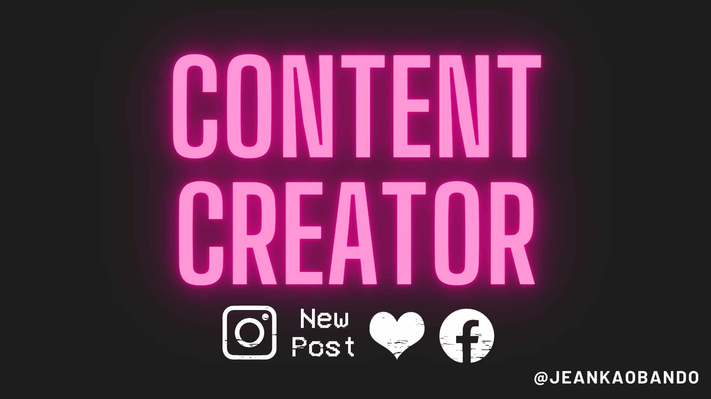
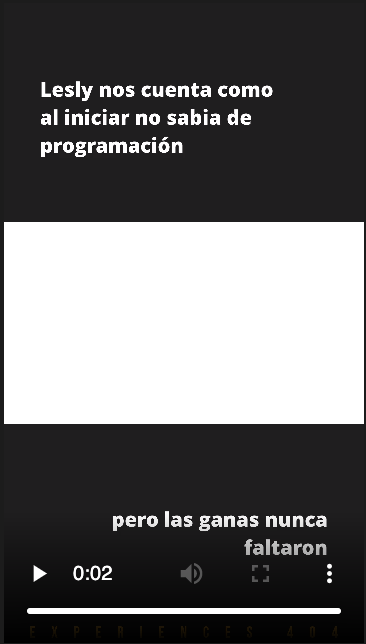
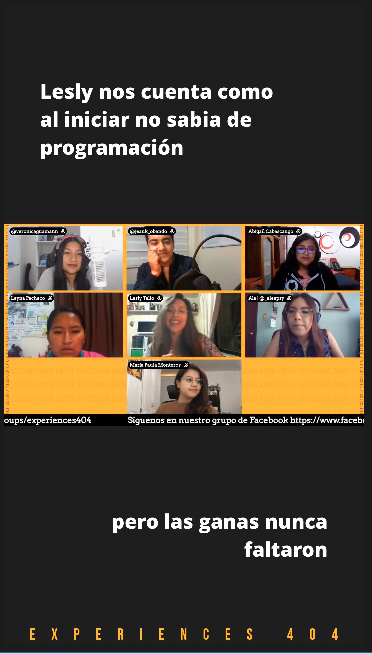

# Content Creator



## Project Description

As host of the podcast @Experiences404 one of the main problems is the creation of content to different plataforms. After recording an episode, we need to split this large video to different clips that uses a basic design and need to be in 9:16 aspect ratio.

This program tooks a base video (16:9) and based on a configuration file create different clips that can be post them on TikTok, Instagram and Facebook.

## Table of Contents

- [Technologies Used](#technologies-used)
- [Features](#features)
- [Installation](#installation)
- [Usage](#usage)
- [Screenshots](#screenshots)
- [Roadmap](#roadmap)
- [License](#license)
- [Contact](#contact)

## Technologies Used

- Python
- MoviePy
- Conventional Commits 

## Features

- Generate a configuration file
- Create diferent clips based on a base video
- Each clip can have footer text (Used to set the brand)
- You can add a common end clip to your videos to make them look standard
- You can customize the background, colors and font of your clips
- You can use a preview mode to check if result match with what you want.

## Installation

1. Clone the repository: `git clone git@github.com:boceto1/boceto1/content-creator.git`
2. Navigate to the project directory: `cd content-creator`
3. Install dependencies: `pip install requirements.txt`

## Usage

### Create Project File

1. Run `python main.py -c [nameProject]`.
2. Edit [nameProject].json file to add the location of your base video, endclip, styles and clips. It would like something like this.

```
{
  "projectName": "Default Project",
  "baseVideo": "./test-video.mp4",
  "endClip": "./templates/endVideo.mp4",
  "styles": {
    "backgroundColor": "#1E1E1E",
    "text": {
      "general": {
        "font": "./resources/OpenSans-ExtraBold.ttf",
        "color": "ffffff"
      },
      "footer":  {
        "font": "./resources/BebasNeue-Regular.ttf",
        "color": "#fbbc09"
      }
    }
  },
  "clips": [
    {
      "name": "De drones a developer",
      "time": [831, 950],
      "text": ["Top Text", "Bottom Text"]
    }
  ]
}

```

_Note:_ You can use fonts that are allowed by MoviePy. You can [check here](https://moviepy-tburrows13.readthedocs.io/en/improve-docs/ref/VideoClip/TextClip.html) to know which fonts are supported. But also, you can add a custom file using a .ttf file.

### Preview Clips
1. Run `python main.py -p ./[projectName].json `
2. It is going to create a dir with the name of your project. Inside this file you can have small clips with just text and styles. (No video).

_Note:_ It's useful when you need to know how your clips are going to look. Process to generate clips takes time so this option helps you to check if all is fine before generate clips.

### Generate Clips
1. Run `python main.py -g ./[projectName].json `
2. It is going to create a dir with the name of your project. Inside this file you can all your clips.

## Screenshots

- Preview Mode



- Generate Mode


## Roadmap

- Support the extraction of audio and creation of banners for Spotify
- Download videos for youtube or twitch directly
- Add more customizations

## License

This project is licensed under the [MIT License](LICENSE).

## Contact

For any questions or inquiries, feel free to reach out to me at janka.obando@outlook.es.
